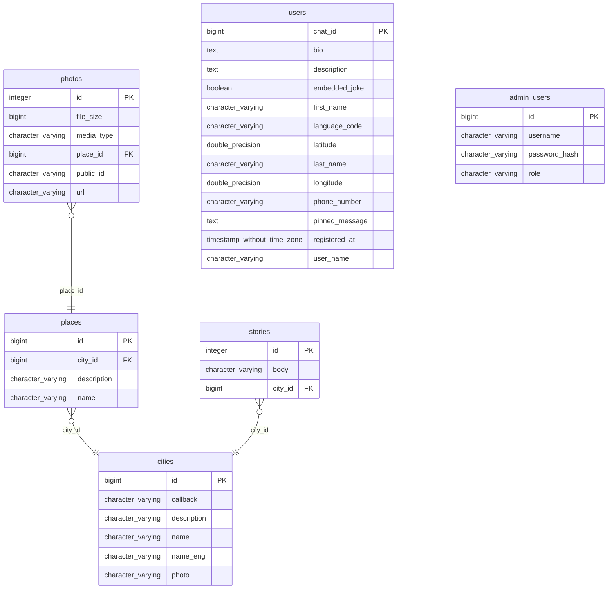

# Описание
Телеграм-бот, который рассказывает истории о выбранном городе, показывает фотографии интересных мест и отображает погоду.  
Ссылка на бота:  

# Стек 
- **Java 17** - основной язык разработки
- **Spring Boot 3** - фреймворк
- **PostgreSQL** - база данных
- **Cloudinary** - хостинг изображений
- **Railway** - хостинг и deployment
- **Telegram Bot API** - интеграция с Telegram

# Структура базы данных

