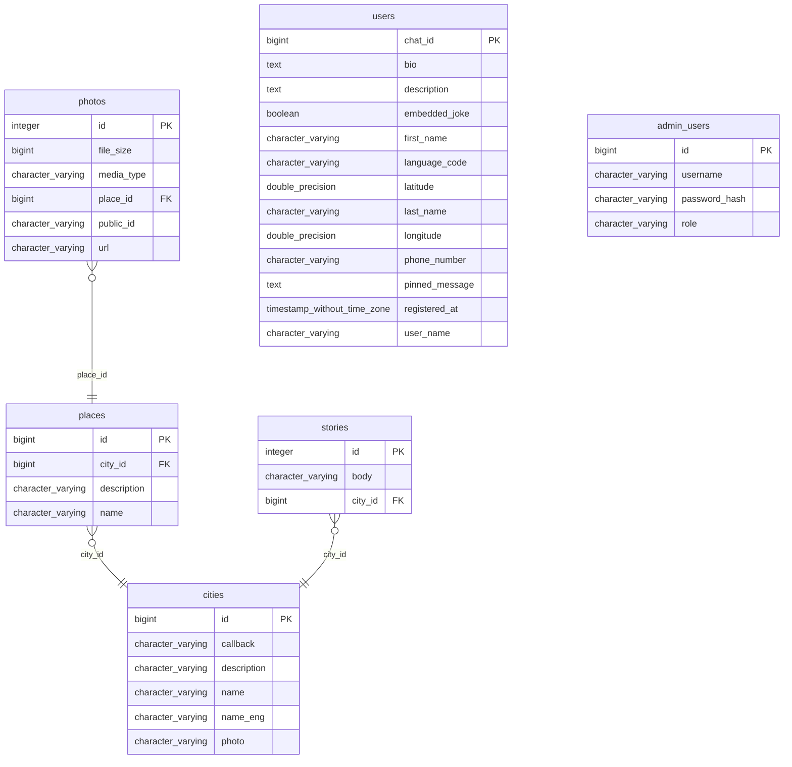

# TownGuide Telegram Bot
Телеграм-бот, который рассказывает исторические факты о городах, показывает фотографии достопримечательностей и отображает текущую погоду.
Ссылка на бота:  
[](https://t.me/Borovsk_bot)

## Админ-панель

Android приложение для управления контентом бота  
(добавление городов, историй и фотографий)

[](https://github.com/gusainovt/townguide-android)

# Технологический стек

| Java 17 | основной язык разработки |
|-----------|-------------|
| Spring Boot | backend framework |
| PostgreSQL | база данных |
| Cloudinary | хранение изображений |
| Railway | деплой |

# Структура базы данных

```mermaid
erDiagram
	cities {
	    bigint id PK
	    character_varying callback
	    character_varying description
	    character_varying name
	    character_varying name_eng
	    character_varying photo
	}
	
	photos {
	    integer id PK
	    bigint file_size
	    character_varying media_type
	    bigint place_id FK
	    character_varying public_id
	    character_varying url
	}
	
	places {
	    bigint id PK
	    bigint city_id FK
	    character_varying description
	    character_varying name
	}
	
	stories {
	    integer id PK
	    character_varying body
	    bigint city_id FK
	}
	
	users {
	    bigint chat_id PK
	    text bio
	    text description
	    boolean embedded_joke
	    character_varying first_name
	    character_varying language_code
	    double_precision latitude
	    character_varying last_name
	    double_precision longitude
	    character_varying phone_number
	    text pinned_message
	    timestamp_without_time_zone registered_at
	    character_varying user_name
	}
	
	 admin_users {
        bigint id PK
        character_varying username
        character_varying password_hash
        character_varying role
    }
	
	places }o--|| cities : "city_id"
	stories }o--|| cities : "city_id"
	photos }o--|| places : "place_id"
```
# Запуск приложения через Docker

## Требования

Перед запуском должны быть установлены:

- **Docker**
- **Docker Compose**
- **Git**

Проверить установку можно командами:

```bash
docker -v
docker compose -v
git -v
```

## Запуск

1. Клонировать репозиторий
`git clone https://github.com/gusainovt/townguide-bot.git`
2. Перейти в директорию проекта
`cd townguide-bot`
3. Запустить контейнеры
`docker compose up --build`

Docker поднимет два контейнера (приложение и БД) 

# Тесты

## Интеграционные тесты (Testcontainers + WireMock)

- Запуск: `mvn test -Dtest=*IT`
- Нужен запущенный Docker (Testcontainers поднимет PostgreSQL и WireMock в контейнерах).
